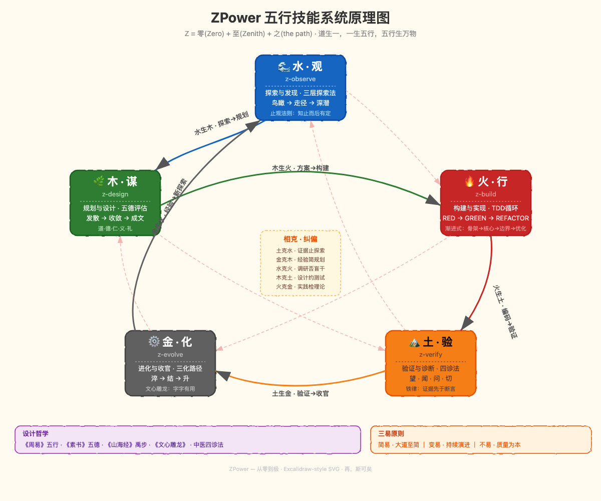

# ZPower — 五行技能系统

> Z = 零(Zero) + 至(Zenith) + 之(the path)
>
> 道生一，一生五行，五行生万物。

ZPower 是一套为 [Claude Code](https://docs.anthropic.com/en/docs/claude-code) 设计的 **AI 辅助开发技能框架**，将中国古典五行哲学映射到现代软件开发工作流，形成一个自循环、自纠偏的开发方法论。

## 五行循环



<details>
<summary>ASCII 版本</summary>

```
          z-observe (观·水)
         ╱ 金生水↑    ↓水生木 ╲
  z-evolve (化·金)      z-design (谋·木)
         ↑ 土生金              木生火 ↓
  z-verify (验·土) ←── 火生土 ── z-build (行·火)
```

</details>

### 相生 — 自然流转

每个阶段完成后自然进入下一个阶段：

| 流转 | 含义 |
|------|------|
| 水 → 木 | 探索充分后，自然进入规划 |
| 木 → 火 | 方案确定后，自然开始构建 |
| 火 → 土 | 代码写完后，自然需要验证 |
| 土 → 金 | 验证通过后，自然进入收官 |
| 金 → 水 | 经验积累后，开启新的探索 |

### 相克 — 纠偏机制

当某个阶段停滞不前时，启动跨阶段纠偏：

| 停滞信号 | 纠偏 | 含义 |
|----------|------|------|
| 探索太久 | 土克水 | 用现有证据止住探索 |
| 规划太久 | 金克木 | 用经验直接简化方案 |
| 编码太久 | 水克火 | 回头确认方向是否正确 |
| 测试太久 | 木克土 | 回到设计约束范围 |
| 总结太久 | 火克金 | 去实践检验理论 |

## 五行技能详解

### 水·观 — z-observe

**何时使用：** 面对不熟悉的代码或项目，需要建立认知。

三层探索法：
1. **鸟瞰**（Glob + ls）— 全局结构
2. **走径**（Grep + Read）— 关键路径
3. **深潜**（Explore Agent）— 核心逻辑

**止观法则：** 能清晰描述任务范围即可停止，不必穷尽所有细节。

---

### 木·谋 — z-design

**何时使用：** 知道做什么，不知怎么做，需要设计决策。

五德评估法（出自《素书》）：

| 德 | 评估维度 | 权重 |
|----|---------|------|
| 道 | 是否触及问题本质 | 必须 |
| 德 | 代码是否可维护 | 必须 |
| 仁 | 使用者是否便利 | 重要 |
| 义 | 逻辑是否严密 | 必须 |
| 礼 | 是否遵循已有约定 | 重要 |

设计流程：发散（2-4 个方案）→ 收敛（五德择优）→ 成文（渐进式步骤）

---

### 火·行 — z-build

**何时使用：** 方案已定，准备写代码。

TDD 三相循环：
- **RED** — 先写一个会失败的测试
- **GREEN** — 写最少的代码使测试通过
- **REFACTOR** — 测试通过后清理代码

渐进式构建：骨架 → 核心功能 → 边界处理 → 优化美化。每步 30-90 分钟，每步有 git commit。

---

### 土·验 — z-verify

**何时使用：** 代码已写，需要验证正确性。

望闻问切四诊法：
- **望** — 读错误信息、日志、diff
- **闻** — 听用户描述、社区讨论、CI 输出
- **问** — 问最近改了什么、环境差异、能否复现
- **切** — 追踪数据流、二分定位、加断点

**铁律：证据先于断言。永远如此。** 先运行、再读输出、然后才能声称结果。

---

### 金·化 — z-evolve

**何时使用：** 验证通过，准备收官和知识沉淀。

三化路径：
1. **淬**（代码审查）— 去除杂质
2. **结**（集成合并）— 归入主干
3. **升**（知识萃取）— 写技能/更新记忆

**文心雕龙原则：** 目的明确、适应不照搬、字字有用。

## 安装使用

### 方式一：直接复制到 Claude Code

将 `skills/` 目录下的各技能文件夹复制到你项目的 `.claude/skills/` 目录：

```bash
# 克隆仓库
git clone https://github.com/hongxin/build-your-own-x.git

# 复制技能到你的项目
cp -r build-your-own-x/skills/z* your-project/.claude/skills/
```

### 方式二：符号链接

```bash
# 将技能系统链接到你的项目
ln -s /path/to/build-your-own-x/skills/zpower your-project/.claude/skills/zpower
ln -s /path/to/build-your-own-x/skills/z-observe your-project/.claude/skills/z-observe
# ... 其余类似
```

### 使用方式

在 Claude Code 中输入 `/zpower` 即可激活五行框架，它会根据你当前的任务阶段自动调用对应的 z-skill。

## 设计哲学

ZPower 的设计融合了多部中国古典著作的智慧：

| 来源 | 应用 |
|------|------|
| 《周易》五行 | 阶段循环与相生相克 |
| 《素书》五德 | 方案评估框架 |
| 《山海经》禹步 | 大型项目探索方法 |
| 《文心雕龙》 | 文档与知识萃取原则 |
| 中医四诊法 | 验证与调试方法论 |

核心理念来自项目根目录 `CLAUDE.md` 的 **道器合一** 方法论：

- **简易** — 能简则简，大道至简
- **变易** — 拥抱变化，持续演进
- **不易** — 坚守核心，质量为本

## 目录结构

```
skills/
├── README.md          # 本文档（中文）
├── README_EN.md       # English documentation
├── zpower/            # 元技能：五行总纲
│   └── SKILL.md
├── z-observe/         # 水·观：探索与发现
│   └── SKILL.md
├── z-design/          # 木·谋：规划与设计
│   └── SKILL.md
├── z-build/           # 火·行：构建与实现
│   └── SKILL.md
├── z-verify/          # 土·验：验证与诊断
│   └── SKILL.md
├── z-evolve/          # 金·化：进化与收官
│   └── SKILL.md
├── z-diagram/         # 图·象：系统图表生成
│   ├── SKILL.md       # 图表生成技能
│   └── EXPERIMENT.md  # 方案评测实验报告
├── zpower-diagram.png     # 五行原理图（中文）
└── zpower-diagram-en.png  # 五行原理图（英文）
```

## 许可

本技能系统随项目开源，欢迎使用、修改和分享。

---

> *"再，斯可矣。"* — 思考够了，就去造吧。
