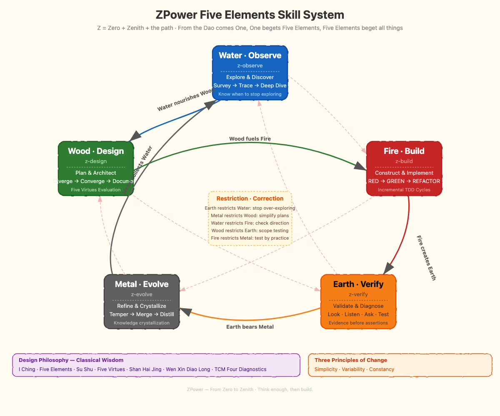

# ZPower — Five Elements Skill System

> Z = Zero + Zenith + the path
>
> From the Dao comes One, One begets Five Elements, Five Elements beget all things.

ZPower is an **AI-assisted development skill framework** designed for [Claude Code](https://docs.anthropic.com/en/docs/claude-code). It maps classical Chinese Five Elements philosophy onto modern software development workflows, forming a self-cycling, self-correcting development methodology.

## Five Elements Cycle



<details>
<summary>ASCII version</summary>

```
          z-observe (Water·Observe)
         ╱ Metal→Water↑    ↓Water→Wood ╲
  z-evolve (Metal·Evolve)      z-design (Wood·Design)
         ↑ Earth→Metal              Wood→Fire ↓
  z-verify (Earth·Verify) ←── Fire→Earth ── z-build (Fire·Build)
```

</details>

### Generation — Natural Flow

Each phase naturally transitions into the next:

| Transition | Meaning |
|-----------|---------|
| Water → Wood | Sufficient exploration leads naturally to planning |
| Wood → Fire | Finalized design leads naturally to building |
| Fire → Earth | Completed code naturally needs verification |
| Earth → Metal | Passing verification leads naturally to wrap-up |
| Metal → Water | Accumulated experience opens new exploration |

### Restriction — Correction Mechanism

When a phase stagnates, cross-phase correction kicks in:

| Stagnation Signal | Correction | Meaning |
|----------|------|---------|
| Exploring too long | Earth restricts Water | Use existing evidence to stop exploring |
| Planning too long | Metal restricts Wood | Use experience to simplify the plan |
| Coding too long | Water restricts Fire | Step back to confirm direction |
| Testing too long | Wood restricts Earth | Return to design constraints |
| Summarizing too long | Fire restricts Metal | Go practice to validate theory |

## Five Element Skills in Detail

### Water · Observe — z-observe

**When to use:** Facing unfamiliar code or projects, needing to build understanding.

Three-layer exploration:
1. **Survey** (Glob + ls) — Global structure
2. **Trace** (Grep + Read) — Key paths
3. **Deep Dive** (Explore Agent) — Core logic

**Stopping rule:** Stop when you can clearly describe the task scope. No need to exhaust every detail.

---

### Wood · Design — z-design

**When to use:** Know *what* to do, but not *how* — need design decisions.

Five Virtues evaluation (from *Su Shu*):

| Virtue | Dimension | Priority |
|--------|-----------|----------|
| Dao (道) | Does it address the root cause? | Required |
| De (德) | Is the code maintainable? | Required |
| Ren (仁) | Is it convenient for users? | Important |
| Yi (义) | Is the logic rigorous? | Required |
| Li (礼) | Does it follow existing conventions? | Important |

Design process: Diverge (2-4 options) → Converge (evaluate by Five Virtues) → Document (incremental steps)

---

### Fire · Build — z-build

**When to use:** Plan is ready, time to write code.

TDD three-phase cycle:
- **RED** — Write a failing test first
- **GREEN** — Write the minimum code to make it pass
- **REFACTOR** — Clean up after tests pass

Incremental building: Skeleton → Core features → Edge cases → Polish. Each step takes 30-90 minutes with a git commit.

---

### Earth · Verify — z-verify

**When to use:** Code is written, need to verify correctness.

Four Diagnostics method (from Traditional Chinese Medicine):
- **Look** — Read error messages, logs, diffs
- **Listen** — Hear user descriptions, community discussions, CI output
- **Ask** — What changed recently? Environment differences? Reproducible?
- **Test** — Trace data flow, binary search, add breakpoints

**Iron rule: Evidence before assertions. Always.** Run first, read the output, then make claims.

---

### Metal · Evolve — z-evolve

**When to use:** Verification passed, ready for wrap-up and knowledge distillation.

Three refinement paths:
1. **Temper** (code review) — Remove impurities
2. **Merge** (integration) — Into the main branch
3. **Distill** (knowledge extraction) — Write skills / update memory

**Wen Xin Diao Long principle:** Clear purpose, adapt don't copy, every word counts.

## Installation

### Option 1: Copy directly into Claude Code

Copy the skill folders from the `skills/` directory to your project's `.claude/skills/` directory:

```bash
# Clone the repository
git clone https://github.com/hongxin/build-your-own-x.git

# Copy skills to your project
cp -r build-your-own-x/skills/z* your-project/.claude/skills/
```

### Option 2: Symbolic links

```bash
# Link the skill system to your project
ln -s /path/to/build-your-own-x/skills/zpower your-project/.claude/skills/zpower
ln -s /path/to/build-your-own-x/skills/z-observe your-project/.claude/skills/z-observe
# ... and so on for the rest
```

### Usage

Type `/zpower` in Claude Code to activate the Five Elements framework. It will automatically invoke the corresponding z-skill based on your current task phase.

## Design Philosophy

ZPower's design draws wisdom from multiple classical Chinese texts:

| Source | Application |
|--------|------------|
| *I Ching* (Book of Changes) — Five Elements | Phase cycling with generation and restriction |
| *Su Shu* (The Plain Book) — Five Virtues | Design evaluation framework |
| *Shan Hai Jing* (Classic of Mountains and Seas) — Yu's Steps | Large project exploration method |
| *Wen Xin Diao Long* (The Literary Mind and the Carving of Dragons) | Documentation and knowledge distillation |
| Traditional Chinese Medicine — Four Diagnostics | Verification and debugging methodology |

Core philosophy comes from the project's root `CLAUDE.md` — **Unity of Dao and Craft**:

- **Simplicity** — Keep it simple; the great Dao is simple
- **Variability** — Embrace change; continuously evolve
- **Constancy** — Hold the core; quality is fundamental

## Directory Structure

```
skills/
├── README.md          # Chinese documentation
├── README_EN.md       # This file (English)
├── zpower/            # Meta-skill: Five Elements overview
│   └── SKILL.md
├── z-observe/         # Water · Observe: Exploration & discovery
│   └── SKILL.md
├── z-design/          # Wood · Design: Planning & architecture
│   └── SKILL.md
├── z-build/           # Fire · Build: Construction & implementation
│   └── SKILL.md
├── z-verify/          # Earth · Verify: Validation & diagnosis
│   └── SKILL.md
├── z-evolve/          # Metal · Evolve: Refinement & crystallization
│   └── SKILL.md
├── z-diagram/         # Diagram · Image: System diagram generation
│   ├── SKILL.md       # Diagram generation skill
│   └── EXPERIMENT.md  # Tool evaluation experiment report
├── zpower-diagram.png     # Five Elements diagram (Chinese)
└── zpower-diagram-en.png  # Five Elements diagram (English)
```

## License

This skill system is open source with the project. Feel free to use, modify, and share.

---

> *"Think twice, then act."* — Confucius
>
> *Think enough, then build.*
