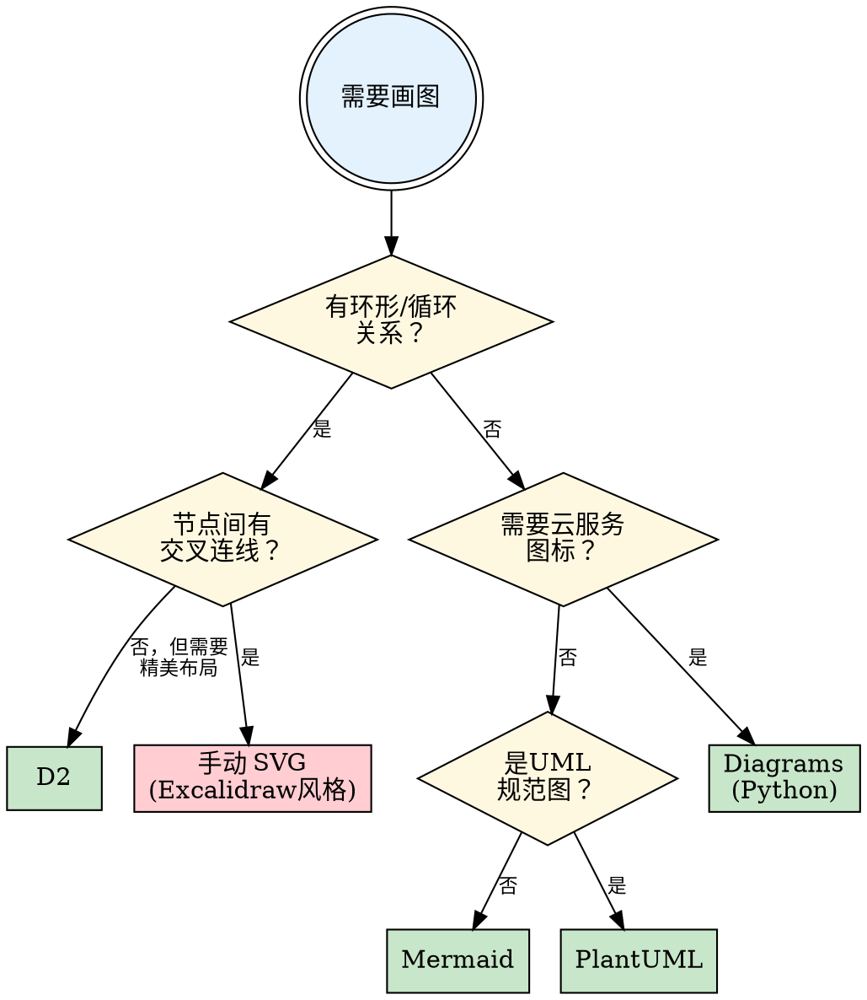

# z-diagram — 图·象

> 「圣人立象以尽意」——《周易·系辞上》。图为意之象，选对图法，方能尽意。

## 核心原则

**图的拓扑决定工具选择，而非工具决定图的形态。**

先判断要画什么类型的图，再选工具。错误的工具选择会导致布局灾难——自动布局引擎无法理解你的语义意图。

## 图类型判定（望图之形）



## 五种图法

### 一、Mermaid — 速图之法

**适用：** 线性流程、树形结构、简单时序图、README 内嵌图

**优势：** LLM 生成质量最高、GitHub 原生渲染、零配置

**局限：** 自动布局仅支持 DAG，环形拓扑会被展开为链条

**工具链：**
```bash
# 渲染（mmdc 随 claude-mermaid 安装）
mmdc -i diagram.mmd -o output.svg -t default
# 或指定完整路径
/path/to/node_modules/.bin/mmdc -i diagram.mmd -o output.png --scale 2
```

**生成要点：**
- 用 `classDef` 自定义节点颜色
- `subgraph` 做分组，但不要超过 3 层嵌套
- 节点超过 15 个时布局会混乱，考虑拆图

---

### 二、D2 — 美图之法

**适用：** 层次架构图、数据流图、需要手绘风格（sketch mode）

**优势：** 视觉质量最佳、Markdown 节点、多主题

**局限：** 免费布局引擎（dagre/elk）不支持环形；TALA 引擎需付费

**工具链：**
```bash
# 基本渲染
d2 input.d2 output.svg

# 手绘风格 + ELK 布局
d2 --sketch --layout elk --pad 40 input.d2 output.png

# 暗色主题
d2 --theme 200 input.d2 output.svg
```

**生成要点：**
- 用 `|md ... |` 做 Markdown 富文本节点
- `style.fill` / `style.stroke` 自定义颜色
- `style.stroke-dash: 5` 做虚线
- `direction: right` / `down` 控制主方向
- 中文 Markdown 节点内容可能被截断，保持文字简短

---

### 三、手动 SVG（Excalidraw 风格）— 意图之法

**适用：** 环形拓扑、全连通网络、非标准布局、需要精确控制的概念图

**优势：** 完全自由的坐标控制、手绘滤镜、最佳视觉效果

**局限：** 需要手动计算坐标、可维护性较低

**工具链：**
```bash
# 生成 HTML+SVG → Playwright 截图
python3 -c "
from playwright.sync_api import sync_playwright
with sync_playwright() as p:
    browser = p.chromium.launch()
    page = browser.new_page(viewport={'width': 1200, 'height': 1000})
    page.goto('file:///path/to/diagram.html')
    page.wait_for_timeout(1000)
    page.locator('#canvas').screenshot(path='output.png')
    browser.close()
"
```

**生成要点：**

SVG 模板结构：
```html
<svg viewBox="0 0 1200 1000">
  <defs>
    <!-- 手绘滤镜 -->
    <filter id="rough">
      <feTurbulence baseFrequency="0.03" numOctaves="4" result="noise"/>
      <feDisplacementMap in="SourceGraphic" in2="noise" scale="1.5"/>
    </filter>
    <!-- 箭头 -->
    <marker id="arrow" viewBox="0 0 10 7" refX="10" refY="3.5"
            markerWidth="10" markerHeight="7" orient="auto-start-reverse">
      <polygon points="0 0, 10 3.5, 0 7" fill="#555"/>
    </marker>
  </defs>
  <!-- 节点用 <g> + <rect> + <text> -->
  <!-- 连线用 <path d="M... C..."> 贝塞尔曲线 -->
</svg>
```

布局策略：
- **环形布局**：N 个节点均匀分布在圆周上，角度 = `360° / N × i`
- **五角布局**：顶部起始，顺时针分布，坐标手动微调
- 相生连线用粗实线（`stroke-width: 3`），颜色跟随源节点
- 相克连线用红色虚线穿越内部（`stroke-dasharray: 6,4`，`opacity: 0.5`）
- 中心区域放说明卡片

---

### 四、Diagrams (Python) — 架构之法

**适用：** 云架构图（AWS/GCP/Azure/K8s）、系统部署图

**优势：** 官方服务图标、Python 代码即图

**工具链：**
```bash
pip install diagrams  # 需要 graphviz 已安装
python3 architecture.py  # 直接生成 PNG
```

---

### 五、PlantUML — 规范之法

**适用：** UML 类图、时序图、状态机、ER 图

**优势：** 最完整的 UML 支持、精细布局控制

**工具链：**
```bash
# 需要 Java + Graphviz
plantuml input.puml
```

## 工作流程

### 1. 判型（望）
问自己：这张图的**核心拓扑**是什么？
- 有向无环 → Mermaid 或 D2
- 有环 + 交叉 → 手动 SVG
- 云架构 → Diagrams
- UML 规范 → PlantUML

### 2. 生成（行）
根据判型选择工具，让 Claude 生成源文件：
- `.mmd` / `.d2` / `.html` / `.py` / `.puml`

### 3. 渲染（化）
执行工具链渲染为 SVG/PNG：
- 优先 SVG（矢量、可缩放）
- PNG 用于 README 嵌入（GitHub 不渲染内联 SVG）

### 4. 验证（验）
- 用 `Read` 工具查看 PNG 截图验证效果
- 检查：布局是否表达语义？文字是否清晰？颜色是否区分层次？

### 5. 多语言（化）
如需国际化：
- 复制源文件，翻译文本内容
- 生成 `-en.png` 英文版
- README 中英文版各引用对应图片

## 常见陷阱

| 陷阱 | 纠偏 |
|------|------|
| 用 Mermaid 画环形图 → 变成面条 | 判型错误，改用手动 SVG |
| D2 图太宽太扁 | 尝试 `direction: down`，或改用手动 SVG |
| SVG 手动坐标太多难以维护 | 只在必要时用手动 SVG，简单图仍用 Mermaid |
| 图中信息过多 | 一张图只表达一个核心概念，复杂系统拆成多张图 |
| 为了美观选错工具 | 先保证拓扑正确，再追求美观 |

## 环境检查

使用前确认工具可用性：

```bash
# Mermaid
mmdc --version 2>/dev/null || echo "需安装: npm install -g claude-mermaid"

# D2
d2 --version 2>/dev/null || echo "需安装: 从 GitHub releases 下载二进制到 ~/.local/bin/"

# Playwright（截图用）
python3 -c "from playwright.sync_api import sync_playwright; print('ok')" 2>/dev/null || echo "需安装 playwright"

# Graphviz（PlantUML/Diagrams 依赖）
dot -V 2>/dev/null || echo "需安装: brew install graphviz"
```

---

> *立象以尽意，选器以达道。*
